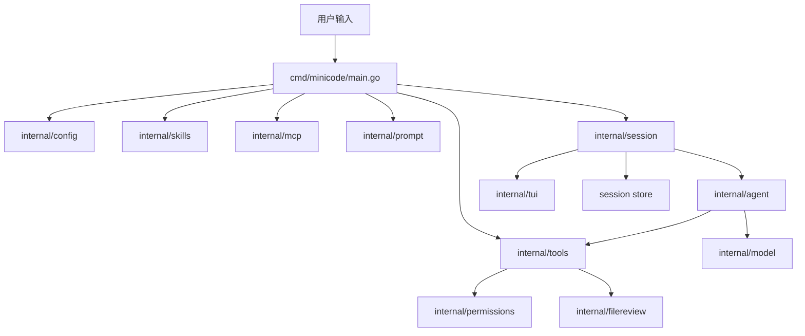

# MiniCode

<p align="center">
  
</p>

<h2 align="center">MiniCode Go</h2>

<p align="center">
  
  
  
  
</p>

---

<p align="center">
  一个以 Go 版本为主线、保留 TypeScript 对照学习价值的轻量级终端 Coding Agent。
</p>

[中文首页](./README.md) | [详细 Go 架构文档](./README_GO.md) | [学习指南](./docs/LEARNING_GUIDE_ZH.md) | [Architecture](./ARCHITECTURE.md) | [Contributing](./CONTRIBUTING.md) | [Roadmap](./ROADMAP.md) | [License](./LICENSE)

MiniCode 是一个面向本地开发工作流的终端编码助手。它保留了 Claude Code 一类产品最核心的执行闭环，但刻意把项目体量控制在容易阅读、容易修改、容易实验的范围内。

当前这个仓库有两条学习价值很高的主线：

- `TypeScript` 版本提供最初的产品形态和交互心智
- `Go` 版本提供一套更完整、更工程化、可持续扩展的实现

如果你想学习终端 Agent 产品怎么从“能跑”变成“可维护、可测试、可开源”，这个仓库很适合作为样本。

## 项目定位

MiniCode 解决的是一个非常具体的问题：

1. 在终端中接收用户请求
2. 把用户请求、系统提示词、上下文和工具定义发给模型
3. 当模型决定需要工具时，调用本地工具或 MCP 工具
4. 在文件修改、命令执行、路径访问前做安全控制
5. 将工具结果送回模型继续推理
6. 在同一会话中返回最终答复

它的核心运行心智只有一条主线：

```text
用户输入
  -> 模型
  -> 工具调用
  -> 工具结果
  -> 模型继续
  -> 最终回答
```

也就是这个仓库里最关键的 `model -> tool -> model` agent loop。

## 为什么值得学习

MiniCode 适合下面这几类读者：

- 想理解 Claude Code 类产品最小可行架构的人
- 想学习 tool calling、session、权限控制、MCP、TUI 如何落地的人
- 想要一个比大型框架更容易改造的参考实现的人
- 想同时对比 TypeScript 与 Go 两种工程组织方式的人

它的优势不在“功能最多”，而在“路径清晰”：

- 主循环短，容易看懂
- 模块边界明确，方便替换
- 有真实的权限与 diff review 约束，不是纯 demo
- Go 版覆盖了更多测试和运行时边界

## Go 版本比 TS 版本多了什么

Go 版不是把 TS 版逐行翻译一遍，而是在功能对齐的基础上往前走了一步。

### 产品能力增强

- 支持 `Anthropic-compatible` 和 `OpenAI-compatible` 两类 provider
- 支持完整会话持久化，包含 `sessions list`、`--resume latest`、`--resume <id>`
- 支持交互式和非交互式 `install-local`
- TUI 与普通行模式双入口，适配不同终端环境

### 架构和稳定性增强

- MCP 客户端有完整的 request id 跟踪、超时恢复和 pending request 清理
- 工具输入支持 JSON Schema 子集校验
- 缺配置时明确报错，而不是隐式 fallback 到 mock
- Agent loop 对 progress、clarification、pause turn、空响应重试等边界做了更细处理

### 工程化增强

- 包划分更清晰，模块职责更稳定
- Go 单元测试和 race 检查覆盖更多关键路径
- TUI 视觉、折叠、宽字符宽度处理更完整

### TS 版本仍然有价值的地方

- 更接近最初的产品原型形态
- 更适合初次理解整个产品概念
- 是 Go 版对齐与增强的参考对象

## 核心能力

### Agent 核心闭环

- 单轮内多步工具调用
- 模型和工具交替执行
- progress 与 final 分离
- 澄清问题会中断执行并等待用户输入
- 工具结果会回灌给模型继续推理

### 内置工具

- `list_files`
- `grep_files`
- `read_file`
- `write_file`
- `modify_file`
- `edit_file`
- `patch_file`
- `run_command`
- `load_skill`
- `list_mcp_resources`
- `read_mcp_resource`
- `list_mcp_prompts`
- `get_mcp_prompt`

### 扩展能力

- 通过 `SKILL.md` 发现本地 skills
- 通过 MCP 动态注册外部工具
- 支持 MCP resources 和 prompts
- 支持按项目加载配置与扩展

### 安全边界

- 路径访问权限检查
- 危险命令识别
- 写文件前 diff review
- 审批拒绝时可把反馈再发回模型
- 支持本轮临时授权和更细粒度的编辑允许范围

### 终端体验

- 全屏 TUI
- transcript 折叠
- 输入历史
- slash 命令菜单
- diff 高亮
- 宽字符和 emoji 宽度处理

## 快速启动

进入项目目录：

```bash
cd /Users/shengbo.sun/Documents/Codex/2026-05-21/https-github-com-ssbsunshengbo-minicode-git/MiniCode
```

### 1. 直接体验 Go 版 mock 模式

```bash
MINI_CODE_MODEL_MODE=mock go run ./cmd/minicode
```

适合用来：

- 验证项目能否启动
- 查看 TUI 或普通行模式
- 体验 slash commands
- 演示工具链路

### 2. 使用 Anthropic-compatible provider

```bash
export ANTHROPIC_MODEL=claude-sonnet-4-5
export ANTHROPIC_AUTH_TOKEN=your-token
go run ./cmd/minicode
```

可选：

```bash
export ANTHROPIC_BASE_URL=https://api.anthropic.com
```

### 3. 使用 OpenAI-compatible provider

```bash
export MINI_CODE_PROVIDER=openai
export OPENAI_MODEL=gpt-4.1
export OPENAI_API_KEY=your-key
go run ./cmd/minicode
```

可选：

```bash
export OPENAI_BASE_URL=https://api.openai.com
```

### 4. 本地安装启动器

```bash
go run ./cmd/minicode install-local
```

安装完成后可直接运行：

```bash
minicode
```

## 如何测试和使用

### 基础测试

```bash
go test ./...
go vet ./...
```

### 重点 race 检查

```bash
go test -race ./internal/agent ./internal/session ./internal/tui ./internal/model ./internal/tools ./internal/mcp ./internal/permissions
```

### TypeScript 侧基础检查

```bash
npm install
npm run check
```

### 快速 smoke test

```bash
printf '/help\n/exit\n' | MINI_CODE_MODEL_MODE=mock go run ./cmd/minicode
```

### 交互里常用命令

```text
/help
/tools
/status
/skills
/mcp
/model
/permissions
/exit
```

### 本地工具快捷命令

```text
/ls [path]
/grep <pattern>::[path]
/read <path>
/write <path>::<content>
/modify <path>::<content>
/edit <path>::<search>::<replace>
/patch <path>::<search1>::<replace1>::...
/cmd [cwd::]<command> [args...]
```

## 整体架构

可以把 Go 版看成几层协作的运行时：



这套结构最重要的设计目标是让每一层只做一件事：

- `cmd/minicode/main.go` 负责装配运行时
- `config` 负责读取配置和环境变量
- `session` 负责一次交互会话的生命周期
- `agent` 负责多步推理和工具调用闭环
- `model` 负责屏蔽不同 provider 的 API 差异
- `tools` 负责统一工具协议、注册和执行
- `permissions` 与 `filereview` 负责安全控制
- `mcp` 负责把外部 server 动态接入为本地工具
- `tui` 负责全屏终端交互层

## 一次请求的完整流程

### 启动阶段

1. 解析命令行参数
2. 判断是否是管理命令，比如 `install-local` 或 `sessions list`
3. 加载运行时配置
4. 发现本地 skills
5. 注册内置工具
6. 启动并接入 MCP servers
7. 创建权限管理器
8. 组装系统提示词
9. 创建模型适配器
10. 创建或恢复 session
11. 判断是否进入 TUI

### 单轮执行阶段

1. 用户输入自然语言或 slash 命令
2. session 追加 user message
3. agent 调用模型生成下一步
4. 如果模型要求调用工具，则执行工具
5. 工具结果写回消息流
6. agent 再次调用模型
7. 重复直到得到 final answer 或需要澄清
8. 输出结果并持久化 session

用伪代码表示就是：

```text
append(user)
loop:
  step = model.next(messages, tools)
  if step asks clarification:
    stop and wait for user
  if step has tool calls:
    run tools
    append(tool_result)
    continue
  if step is final:
    output and save
    break
```

## 项目结构

```text
MiniCode/
├── cmd/minicode            # 程序入口
├── internal/agent          # Agent loop
├── internal/model          # Provider 适配
├── internal/message        # 内部消息协议
├── internal/tools          # 工具注册、校验、执行
├── internal/permissions    # 路径与命令权限
├── internal/filereview     # 写入前 diff review
├── internal/session        # 会话生命周期与持久化
├── internal/tui            # 全屏终端 UI
├── internal/mcp            # MCP client 与动态工具包装
├── internal/skills         # SKILL.md 发现与加载
├── internal/config         # 配置加载
├── internal/manage         # 管理命令
├── internal/install        # 本地安装器
├── src/                    # TS 版本参考实现
├── docs/                   # 学习文档与展示资源
└── README_GO.md            # Go 版深入文档
```

## 核心模块拆解

### `internal/agent`

这是系统的大脑。它负责：

- 控制 `model -> tool -> model` 闭环
- 判断当前输出是 progress、clarification 还是 final
- 处理工具结果回灌
- 处理空响应重试和部分中断恢复

如果你想真正看懂“Coding Agent 是怎么跑起来的”，这里是最关键的阅读入口。

### `internal/model`

这一层负责把内部统一消息协议转换为具体 provider 的请求格式，再把 provider 返回结果解析回系统内部结构。

它的价值在于隔离供应商差异，让 `agent` 始终只依赖统一接口，而不是依赖 Anthropic 或 OpenAI 的原生返回结构。

### `internal/tools`

这一层定义工具协议、参数 schema、工具注册、工具执行和错误返回格式。对 Agent 来说，工具不是散落的函数，而是一组统一可调度能力。

### `internal/permissions` + `internal/filereview`

这是 MiniCode 不只是 demo 的关键。项目没有让模型“想写就写、想跑就跑”，而是加了真实的边界：

- 能不能访问某个路径
- 命令是否危险
- 写文件前是否需要 review
- 用户是否显式允许这类操作

### `internal/mcp`

MCP 这一层负责与外部工具生态对接。它会启动 server、完成协议读写、管理请求超时，并把远端暴露的工具转换成当前会话里的本地可调用工具。

### `internal/session` + `internal/tui`

这两层共同组成用户能看到的产品表面：

- session 管理消息流和持久化
- TUI 负责输入、滚动、审批、折叠、渲染

因此它们不是“UI 附件”，而是产品交互体验的一部分。

## 当前仓库的阅读建议

如果你是第一次看这个项目，推荐顺序如下：

1. 先看 [README_GO.md](./README_GO.md) 形成整体概念
2. 再看 [docs/LEARNING_GUIDE_ZH.md](./docs/LEARNING_GUIDE_ZH.md) 了解启动、测试和交互方式
3. 然后从 [cmd/minicode/main.go](/Users/shengbo.sun/Documents/Codex/2026-05-21/https-github-com-ssbsunshengbo-minicode-git/MiniCode/cmd/minicode/main.go:1) 进入
4. 接着读 [internal/agent/loop.go](/Users/shengbo.sun/Documents/Codex/2026-05-21/https-github-com-ssbsunshengbo-minicode-git/MiniCode/internal/agent/loop.go:1)
5. 再读 `model`、`tools`、`permissions`、`mcp`、`session`
6. 最后回头对照 `src/` 下 TS 版本看产品演化

## 文档导航

- [详细 Go 架构文档](./README_GO.md)
- [MiniCode 学习指南](./docs/LEARNING_GUIDE_ZH.md)
- [Architecture](./ARCHITECTURE.md)
- [Roadmap](./ROADMAP.md)
- [Contributing](./CONTRIBUTING.md)
- [通过 MiniCode 学习 Claude Code 设计](./CLAUDE_CODE_PATTERNS.md)

## 致谢与说明

- 本仓库的 README 展示样式、Logo 与产品展示页资源参考并改编自 [LiuMengxuan04/MiniCode](https://github.com/LiuMengxuan04/MiniCode)。
- 参考仓库使用 [MIT License](https://github.com/LiuMengxuan04/MiniCode/blob/main/LICENSE)，当前保留了相应的开源使用前提。
- 当前仓库的重点是 Go 版本的完整实现与架构学习价值，而不是逐字复刻原始文案。
