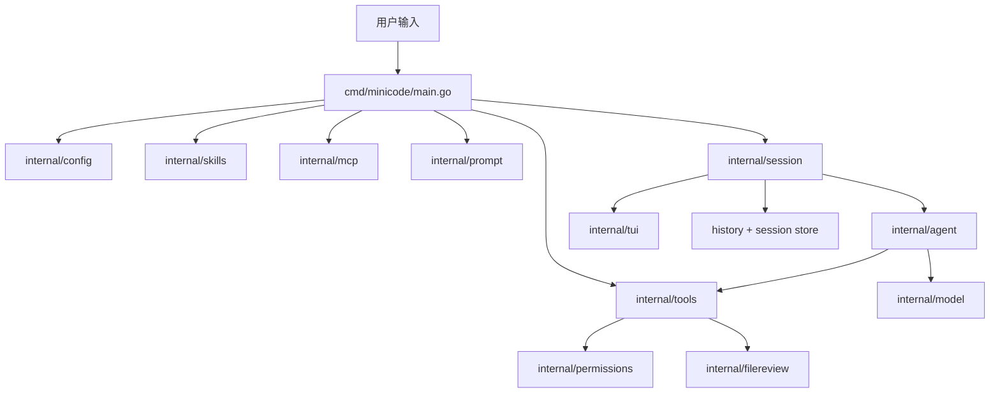

# MiniCode Go

MiniCode Go 是 MiniCode 终端编码助手的 Go 语言实现版本。它延续了原始 TypeScript 版本的核心产品模型，同时用更 Go-native 的方式重构了运行时、模块边界、测试体系和终端交互层。

这份 README 面向两个读者群体：

- 想快速运行和体验 Go 版本的使用者
- 想学习终端 Coding Agent 架构与实现细节的开发者

如果你更希望看一份更像教程的中文说明，可以继续阅读 [MiniCode 学习指南](./docs/LEARNING_GUIDE_ZH.md)。

## 目录

- [项目定位](#项目定位)
- [Go 版本比 TS 版本多了什么](#go-版本比-ts-版本多了什么)
- [功能概览](#功能概览)
- [快速启动](#快速启动)
- [安装方式](#安装方式)
- [如何使用](#如何使用)
- [整体架构](#整体架构)
- [运行流程](#运行流程)
- [项目结构](#项目结构)
- [核心模块说明](#核心模块说明)
- [测试与验证](#测试与验证)
- [设计思路](#设计思路)
- [当前限制](#当前限制)
- [推荐阅读顺序](#推荐阅读顺序)

## 项目定位

MiniCode Go 是一个终端优先的轻量级 Coding Agent。它保留了 Claude Code 一类产品最核心的执行闭环，但避免把工程做成庞大的平台。

它解决的问题是：

1. 在终端里接收用户请求
2. 基于系统提示词和上下文调用模型
3. 当模型需要时执行本地工具或 MCP 工具
4. 在写文件、跑危险命令、访问越界路径前做权限控制
5. 把工具结果回传给模型继续推理
6. 最终返回一条可以落地的回答

整个项目最重要的主线就是：

```text
用户输入
  -> 系统提示词
  -> 模型
  -> 工具调用
  -> 工具结果
  -> 模型继续
  -> 最终回答
```

这就是这个仓库反复出现的 `model -> tool -> model` agent loop。

## Go 版本比 TS 版本多了什么

Go 版本不是简单翻译，而是在追求产品对齐的同时补了一些额外能力。

### 产品能力上的增强

- 除了 `Anthropic-compatible Messages API`，还支持 `OpenAI-compatible Chat Completions API`
- 支持完整会话持久化，保存在 `~/.mini-code/sessions`
- 支持 `sessions list`
- 支持 `--resume latest`
- 支持 `--resume <session-id>`
- 提供 Go 原生 `install-local` 管理命令，支持交互与非交互安装

### 运行时与稳定性增强

- 在工具执行前做 JSON Schema 子集校验
- 支持字符串、数值、数组、枚举、对象和 `additionalProperties: false` 等常见约束
- MCP 客户端支持请求 ID 跟踪、超时回收、pending request 清理和失败恢复
- 缺少模型配置时不会静默进入 mock，而是清晰报错
- 对 agent loop、权限、MCP、TUI、session、schema 校验等路径有较完整测试

### 终端体验上的增强

- 纯 Go 实现全屏 alternate-screen TUI
- transcript 自动折叠成功工具输出
- 同文件编辑聚合展示
- diff 语法高亮
- markdown-ish 渲染
- CJK/emoji 宽字符显示宽度处理
- 卡片式 Unicode panel 和状态色彩

### 不属于“更多”，而是“对齐”的部分

下面这些是 Go 版和 TS 版共享的核心产品心智，不是额外扩展：

- `model -> tool -> model` 主循环
- 文件修改前 review
- 本地 skills
- MCP 动态工具加载
- 权限审批
- slash commands
- 本地工具快捷命令

## 功能概览

### 核心工作流

- 单回合内多步工具调用
- 模型与工具的交替执行
- TUI 交互模式与行模式并存
- slash commands 与本地工具快捷命令
- 工作区感知的路径解析
- 会话持久化与恢复

### 内置工具

- `list_files`
- `grep_files`
- `read_file`
- `write_file`
- `modify_file`
- `edit_file`
- `patch_file`
- `run_command`
- `load_skill`
- `list_mcp_resources`
- `read_mcp_resource`
- `list_mcp_prompts`
- `get_mcp_prompt`

### 安全边界

- 路径访问权限检查
- 危险命令识别
- 文件编辑审批
- diff review 后再写入
- 拒绝并向模型反馈修正建议

### 可扩展能力

- `SKILL.md` 工作流发现与加载
- MCP stdio server 启动
- MCP 工具动态包装
- MCP 资源与 prompts 暴露为通用 helper tools

## 快速启动

先进入项目目录：

```bash
cd /Users/shengbo.sun/Documents/Codex/2026-05-21/https-github-com-ssbsunshengbo-minicode-git/MiniCode
```

### 1. Mock 模式启动

最快速的体验方式：

```bash
MINI_CODE_MODEL_MODE=mock go run ./cmd/minicode
```

这个模式适合：

- 测试项目是否能启动
- 查看 TUI 界面
- 试 slash commands
- 演示工具链路
- 不依赖真实模型 API 做学习和演示

### 2. Anthropic 兼容模式启动

```bash
export ANTHROPIC_MODEL=claude-sonnet-4-5
export ANTHROPIC_AUTH_TOKEN=你的密钥
go run ./cmd/minicode
```

可选：

```bash
export ANTHROPIC_BASE_URL=https://api.anthropic.com
```

### 3. OpenAI 兼容模式启动

```bash
export MINI_CODE_PROVIDER=openai
export OPENAI_MODEL=gpt-4.1
export OPENAI_API_KEY=你的密钥
go run ./cmd/minicode
```

可选：

```bash
export OPENAI_BASE_URL=https://api.openai.com
```

### 4. 缺配置时的行为

如果你没有设置模型配置，并且也没有显式开启 mock：

```bash
go run ./cmd/minicode
```

Go 版本不会偷偷进入 mock 模式，而是会明确报出请求失败。这一点是故意设计的，目的是让运行时行为更可预期，也更接近 TS 版真实模型路径。

## 安装方式

### 本地安装

```bash
go run ./cmd/minicode install-local
```

这个命令会：

- 把二进制构建到 `~/.mini-code/bin/minicode-go`
- 在 `~/.local/bin/minicode` 写一个 launcher
- 在需要时写入模型配置

如果你的 `PATH` 里还没有 `~/.local/bin`，加入：

```bash
export PATH="$HOME/.local/bin:$PATH"
```

### 交互安装

如果你在真实终端里执行 `install-local` 且没有传入配置 flags，它会交互询问：

- provider
- model
- base URL
- token 或 API key

### 非交互安装

适合自动化或可复现实验环境：

```bash
go run ./cmd/minicode install-local \
  --provider openai \
  --model gpt-4.1 \
  --api-key your-key
```

## 如何使用

### 管理命令

```bash
go run ./cmd/minicode --help
go run ./cmd/minicode install-local
go run ./cmd/minicode sessions list
go run ./cmd/minicode mcp list
go run ./cmd/minicode mcp add filesystem -- npx -y @modelcontextprotocol/server-filesystem .
go run ./cmd/minicode mcp remove filesystem
go run ./cmd/minicode skills list
go run ./cmd/minicode skills add /path/to/skill --name my-skill
go run ./cmd/minicode skills remove my-skill
```

### 会话命令

```bash
go run ./cmd/minicode --resume latest
go run ./cmd/minicode --resume <session-id>
```

### 交互界面里的 slash commands

```text
/help
/tools
/status
/model
/model <name>
/config-paths
/skills
/mcp
/permissions
/exit
```

### 本地工具快捷命令

```text
/ls [path]
/grep <pattern>::[path]
/read <path>
/write <path>::<content>
/modify <path>::<content>
/edit <path>::<search>::<replace>
/patch <path>::<search1>::<replace1>::...
/cmd [cwd::]<command> [args...]
```

### 自然语言直接使用

你也可以直接让它做事，例如：

```text
请帮我看看 README.md 的主要内容
```

或者：

```text
请新建一个 notes.txt，内容写 hello world
```

这会触发真正的 agent loop：

- 模型决定是否需要读文件或写文件
- 工具被执行
- 工具结果回到模型
- 模型再给出下一步或最终回答

## 整体架构

从高层看，MiniCode Go 可以理解为一组分层协作的运行时模块：



这个架构的核心思路是分离职责：

- `main.go` 只负责组装运行时对象
- `session` 负责交互和输出
- `agent` 负责多步推理和工具调用闭环
- `model` 屏蔽不同模型 API 的差异
- `tools` 提供统一工具协议和执行边界
- `permissions` 与 `filereview` 负责安全约束
- `mcp` 把外部 server 动态转换成本地工具

## 运行流程

入口在 [cmd/minicode/main.go](/Users/shengbo.sun/Documents/Codex/2026-05-21/https-github-com-ssbsunshengbo-minicode-git/MiniCode/cmd/minicode/main.go:1)。

启动过程大致如下：

1. 解析启动参数，例如 `--resume`
2. 如果是管理命令，直接路由到 `manage`
3. 加载运行时配置
4. 发现本地 skills
5. 注册内置工具
6. 启动 MCP servers 并包装远端工具
7. 创建权限管理器
8. 构建 system prompt
9. 选择模型适配器
10. 创建新 session 或恢复旧 session
11. 根据终端环境决定进入 TUI 还是行模式

可以简化成伪代码：

```text
parse args
if management command:
  handle and exit

runtime = load config
skills = discover skills
tools = builtins + mcp tools
permissions = new manager
system prompt = build prompt
model = mock | error | anthropic | openai
session = new session

if stdin/stdout are TTY:
  run TUI
else:
  run line mode
```

每一次用户输入的执行过程则是：

```text
用户输入
  -> append user message
  -> agent loop
  -> model step
  -> maybe tool calls
  -> execute tools
  -> append tool_result
  -> more model steps
  -> final assistant response
  -> persist session
```

## 项目结构

### 入口

```text
cmd/minicode/main.go
```

### 核心运行时包

```text
internal/agent
internal/model
internal/message
internal/tools
internal/permissions
internal/filereview
internal/workspace
internal/session
internal/tui
internal/config
internal/skills
internal/mcp
internal/manage
internal/install
internal/commands
```

### 测试

大多数包都带有配套测试：

```text
internal/*/*_test.go
cmd/minicode/main_test.go
```

这也是 Go 版很适合学习的一个原因：你可以直接从测试理解行为，再去读实现。

## 核心模块说明

### `internal/message`

这个包定义了 session、agent 和 model 之间共享的内部协议。

核心概念包括：

- `Message`
- `ToolCall`
- `Diagnostics`
- `Step`
- `ContentKind`

它把系统内部消息统一为：

- system
- user
- assistant
- assistant_progress
- assistant_tool_call
- tool_result

这样整个系统就可以用模型无关的格式交流。

### `internal/model`

这个包放模型适配器和 provider 选择逻辑。

文件包括：

- `anthropic.go`
- `openai.go`
- `mock.go`
- `error.go`
- `factory.go`

职责是：

- 把内部消息转换成 Anthropic 或 OpenAI 兼容请求
- 把工具 schema 附加到模型请求中
- 把模型返回解析成统一的 `Step`
- 保留 stop reason、ignored blocks 等诊断信息

设计上最重要的一点是：agent loop 永远只调用统一接口：

```go
Next(ctx, messages)
```

它不直接依赖具体厂商 API，因此控制流更干净，也更好测。

### `internal/agent`

这个包是 MiniCode Go 的核心大脑，负责单回合里的多步执行。

职责包括：

- 多次调用模型直到任务完成
- 区分 progress 和 final
- 执行工具
- 把工具结果回传给模型
- 对空响应和 thinking 中断做恢复
- 遇到澄清问题时停下来问用户
- 在必要时给出诊断型 fallback

值得注意的行为细节：

- 工具结果后的普通状态文本会被当作 progress，而不是误判为最终答案
- 如果模型在 `tool_calls` 响应里同时给出澄清问题，会先停下来问用户，不会继续执行工具
- 对 `pause_turn` 和 `max_tokens` 的 thinking 中断会自动续跑
- 对空响应只做有限次数重试，避免死循环

如果你想学习 agent behavior engineering，这个包非常值得细看。

### `internal/tools`

这个包负责统一工具定义、注册、输入校验和执行。

它包含：

- 工具定义结构
- 工具注册表
- 输入归一化
- schema 校验
- 内置工具实现

一个工具抽象上包含：

```text
name
description
input schema
run function
```

执行链路是：

```text
按名称查找工具
  -> 归一化输入
  -> 做 schema 校验
  -> 执行工具
  -> 必要时把 panic 转换成错误
```

这是整个系统“模型能力”和“本地可执行能力”之间的桥。

### `internal/permissions`

这个包实现安全边界，管理三类权限：

- 路径访问
- 命令执行
- 文件编辑

支持的决策包括：

- `allow_once`
- `allow_always`
- `allow_turn`
- `allow_all_turn`
- `deny_once`
- `deny_always`
- `deny_with_feedback`

持久化文件位于：

```text
~/.mini-code/permissions.json
```

危险命令识别覆盖了例如：

- `git reset --hard`
- `git clean`
- `git checkout --`
- `git restore --source`
- `git push --force`
- `npm publish`

### `internal/filereview`

这个包负责“先 review，后写文件”。

文件修改不是直接落盘，而是：

1. 比较旧内容和新内容
2. 生成 unified diff
3. 进入编辑权限审批
4. 审批通过后才真正写入

这样用户可以清楚看到模型打算改什么，也更适合教学和审计。

### `internal/workspace`

这个包负责工作区路径解析，把“模型给出的路径”转换成“运行时实际要访问的路径”。

它也是 cwd 边界控制的一部分，会在需要时调用权限系统确认是否允许访问工作区外部路径。

### `internal/session`

这个包负责用户交互层。

它支持两种模式：

- TUI 模式：stdin/stdout 是真实终端时进入
- 行模式：用于脚本、管道、非 TTY 环境

职责包括：

- prompt 输入处理
- slash command 执行
- 本地快捷工具执行
- transcript 更新
- 会话保存
- 历史保存
- 审批弹窗接入

重点文件包括：

- `session.go`
- `tui.go`
- `history.go`
- `store.go`

### `internal/tui`

这个包是纯 Go 终端表现层。

职责包括：

- panel 渲染
- transcript 渲染
- 输入框渲染
- diff 高亮
- markdown-ish 渲染
- 键盘与滚轮输入解析

当前能力包括：

- alternate-screen 全屏 UI
- 卡片式 Unicode 边框
- ANSI 颜色
- slash menu 反色高亮
- transcript 工具输出折叠
- diff 语法高亮
- CJK 和 emoji 宽字符显示宽度处理

### `internal/config`

这个包负责从多来源合并运行时配置：

- `~/.mini-code/settings.json`
- `~/.mini-code/mcp.json`
- 项目 `.mcp.json`
- 兼容 Claude settings
- 进程环境变量

最终会整理出：

- provider
- model
- base URL
- auth token
- API key
- max output tokens

### `internal/skills`

这个包负责本地 `SKILL.md` 工作流的发现和管理。

搜索位置包括：

- `./.mini-code/skills`
- `~/.mini-code/skills`
- `./.claude/skills`
- `~/.claude/skills`

支持：

- list
- install
- remove
- load skill contents

### `internal/mcp`

这个包负责启动和管理 stdio MCP servers。

能力包括：

- `initialize`
- `tools/list`
- `resources/list`
- `resources/read`
- `prompts/list`
- `prompts/get`

实现上的关键点：

- 同时支持 `Content-Length` 和 newline-delimited JSON
- 把远端工具包装成 `mcp__server__tool`
- 用请求 ID 跟踪 pending requests
- 请求超时后能正确恢复
- 退出时清理子进程

如果你想学习如何在一个小型项目里接入 MCP，这个包很有参考价值。

### `internal/manage` 与 `internal/install`

这两个包负责：

- `install-local`
- `mcp list/add/remove`
- `skills list/add/remove`
- `sessions list`

安装器把配置和二进制都写进 MiniCode 自己的目录，而不是污染其它本地工具。

## 测试与验证

### 全量测试

```bash
go test ./...
```

### race 检查

```bash
go test -race ./internal/agent ./internal/session ./internal/tui ./internal/model ./internal/tools ./internal/mcp ./internal/permissions
```

### 静态检查

```bash
go vet ./...
```

### mock smoke test

```bash
printf '/help\n/exit\n' | MINI_CODE_MODEL_MODE=mock go run ./cmd/minicode
```

### 无配置错误 smoke test

```bash
printf 'hello\n/exit\n' | \
  env -u ANTHROPIC_MODEL \
      -u ANTHROPIC_AUTH_TOKEN \
      -u ANTHROPIC_API_KEY \
      -u OPENAI_MODEL \
      -u OPENAI_API_KEY \
      -u MINI_CODE_MODEL \
      -u MINI_CODE_PROVIDER \
      -u MINI_CODE_MODEL_MODE \
      HOME=$(mktemp -d) \
      go run ./cmd/minicode
```

这个用例应该明确报错，而不是悄悄进 mock。

## 设计思路

### 为什么这个项目适合学习

Go 版的价值在于：它展示了一个完整 Coding Agent 运行时，但不依赖：

- 重型 UI 框架
- 数据库
- Web 后端
- IDE bridge
- 复杂插件平台

同时，它又足够完整，可以看到真实问题：

- 多步 agent 控制
- 模型抽象
- 安全边界
- 终端 UX 设计
- 外部工具编排
- MCP 集成

### 为什么要拆成很多小包

这是有意为之。这样的包结构更容易区分：

- 哪部分是产品逻辑
- 哪部分是 provider 逻辑
- 哪部分是终端渲染
- 哪部分是持久化
- 哪部分是安全策略

这种模块边界也让测试更自然，更适合作为学习用参考实现。

## 当前限制

虽然 Go 版核心能力已经很完整，但仍有一些可继续打磨的点：

- 还缺一个真实公共 MCP server 的集成 smoke test
- TUI 视觉和交互细节虽然已经较完整，但与 TS 版仍不是逐像素一致
- JSON Schema 目前是实用子集，不是完整规范实现
- 某些 provider 兼容路径是轻量适配器，不是完整官方 SDK 语义

这些都可以作为后续继续演进的方向。

## 推荐阅读顺序

如果你想快速读懂这个项目，推荐按下面顺序读源码：

1. [cmd/minicode/main.go](/Users/shengbo.sun/Documents/Codex/2026-05-21/https-github-com-ssbsunshengbo-minicode-git/MiniCode/cmd/minicode/main.go:1)
2. [internal/session/session.go](/Users/shengbo.sun/Documents/Codex/2026-05-21/https-github-com-ssbsunshengbo-minicode-git/MiniCode/internal/session/session.go:1)
3. [internal/agent/loop.go](/Users/shengbo.sun/Documents/Codex/2026-05-21/https-github-com-ssbsunshengbo-minicode-git/MiniCode/internal/agent/loop.go:1)
4. [internal/model/anthropic.go](/Users/shengbo.sun/Documents/Codex/2026-05-21/https-github-com-ssbsunshengbo-minicode-git/MiniCode/internal/model/anthropic.go:1)
5. [internal/tools/builtin.go](/Users/shengbo.sun/Documents/Codex/2026-05-21/https-github-com-ssbsunshengbo-minicode-git/MiniCode/internal/tools/builtin.go:1)
6. [internal/permissions/permissions.go](/Users/shengbo.sun/Documents/Codex/2026-05-21/https-github-com-ssbsunshengbo-minicode-git/MiniCode/internal/permissions/permissions.go:1)
7. [internal/mcp/mcp.go](/Users/shengbo.sun/Documents/Codex/2026-05-21/https-github-com-ssbsunshengbo-minicode-git/MiniCode/internal/mcp/mcp.go:1)
8. [internal/tui/render.go](/Users/shengbo.sun/Documents/Codex/2026-05-21/https-github-com-ssbsunshengbo-minicode-git/MiniCode/internal/tui/render.go:1)

如果你更希望从中文讲解入手，再配合源码看，可以继续读：

[docs/LEARNING_GUIDE_ZH.md](/Users/shengbo.sun/Documents/Codex/2026-05-21/https-github-com-ssbsunshengbo-minicode-git/MiniCode/docs/LEARNING_GUIDE_ZH.md:1)
