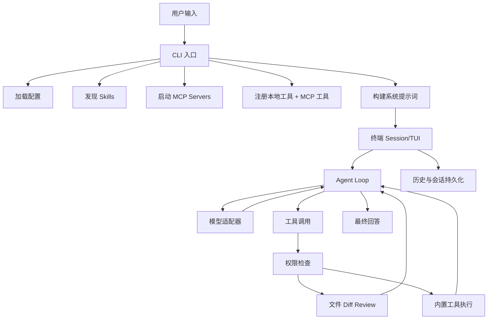

# MiniCode 学习指南

这份文档面向第一次阅读 MiniCode 项目的同学，目标是把项目如何启动、产品定位、目录结构、核心流程和关键源码讲清楚。

MiniCode 当前仓库里有两套实现：

- TypeScript 版：原始实现，代码在 `src/`。
- Go 版：我们补齐的核心对齐版，代码在 `cmd/` 和 `internal/`。

如果你的目标是学习“终端 Coding Agent 怎么工作”，建议先读 TypeScript 版，因为它更紧凑；如果你的目标是学习“如何用 Go 实现同类产品”，建议从 Go 版开始。

## 1. 项目定位

MiniCode 是一个轻量级终端编码助手。它模仿 Claude Code 这类产品的核心工作方式，但把实现缩小到一个更容易学习、修改和扩展的代码库。

它解决的问题是：

- 用户在终端里提出开发任务。
- 模型根据任务决定是否需要读文件、搜代码、跑命令、改文件。
- 工具执行结果回到模型。
- 模型继续判断下一步，直到给出最终答案。
- 对危险命令、越界路径、文件写入做权限控制和 diff review。

核心心智模型是：

```text
用户输入
  -> 系统提示词
  -> 模型
  -> 工具调用
  -> 工具结果
  -> 模型继续
  -> 最终回答
```

这就是项目里反复出现的 `model -> tool -> model` agent loop。

## 2. 快速启动

先进入仓库目录：

```bash
cd /Users/shengbo.sun/Documents/Codex/2026-05-21/https-github-com-ssbsunshengbo-minicode-git/MiniCode
```

### 2.1 启动 TypeScript 版

安装依赖：

```bash
npm install
```

离线 mock 模式启动：

```bash
MINI_CODE_MODEL_MODE=mock npm run dev
```

真实模型模式启动：

```bash
export ANTHROPIC_MODEL=claude-sonnet-4-5
export ANTHROPIC_AUTH_TOKEN=你的密钥
npm run dev
```

安装到本地命令：

```bash
npm run install-local
```

安装后可以运行：

```bash
minicode
```

### 2.2 启动 Go 版

离线 mock 模式启动：

```bash
MINI_CODE_MODEL_MODE=mock go run ./cmd/minicode
```

Anthropic 兼容模型启动：

```bash
export ANTHROPIC_MODEL=claude-sonnet-4-5
export ANTHROPIC_AUTH_TOKEN=你的密钥
go run ./cmd/minicode
```

OpenAI 兼容模型启动：

```bash
export MINI_CODE_PROVIDER=openai
export OPENAI_MODEL=gpt-4.1
export OPENAI_API_KEY=你的密钥
go run ./cmd/minicode
```

安装 Go 版本地命令：

```bash
go run ./cmd/minicode install-local
```

非交互写入配置并安装：

```bash
go run ./cmd/minicode install-local \
  --provider openai \
  --model gpt-4.1 \
  --api-key 你的密钥
```

恢复最近会话：

```bash
go run ./cmd/minicode --resume latest
```

查看保存的会话：

```bash
go run ./cmd/minicode sessions list
```

## 3. 常用命令

MiniCode 启动后，在交互界面可以使用这些 slash commands：

```text
/help
/tools
/status
/model
/model <model-name>
/config-paths
/skills
/mcp
/permissions
/exit
```

本地工具快捷命令：

```text
/ls [path]
/grep <pattern>::[path]
/read <path>
/write <path>::<content>
/modify <path>::<content>
/edit <path>::<search>::<replace>
/patch <path>::<search1>::<replace1>::...
/cmd [cwd::]<command> [args...]
```

管理命令：

```bash
minicode mcp list
minicode mcp add <name> [--project] [--protocol content-length|newline-json] [--env KEY=VALUE] -- <command> [args...]
minicode mcp remove <name> [--project]

minicode skills list
minicode skills add <path-to-skill-or-dir> [--name <name>] [--project]
minicode skills remove <name> [--project]
```

Go 版额外支持：

```bash
minicode sessions list
minicode --resume latest
minicode --resume <session-id>
```

## 4. 配置文件

MiniCode 使用独立配置目录，不污染其它工具：

```text
~/.mini-code/settings.json
~/.mini-code/mcp.json
~/.mini-code/permissions.json
~/.mini-code/history.json
~/.mini-code/sessions/
```

也兼容部分 Claude Code 配置：

```text
~/.claude/settings.json
项目目录/.mcp.json
```

典型配置示例：

```json
{
  "model": "claude-sonnet-4-5",
  "env": {
    "ANTHROPIC_BASE_URL": "https://api.anthropic.com",
    "ANTHROPIC_AUTH_TOKEN": "your-token",
    "ANTHROPIC_MODEL": "claude-sonnet-4-5"
  },
  "mcpServers": {
    "filesystem": {
      "command": "npx",
      "args": ["-y", "@modelcontextprotocol/server-filesystem", "."]
    }
  }
}
```

配置合并顺序可以理解为：

```text
Claude fallback settings
  -> ~/.mini-code/mcp.json
  -> 项目 .mcp.json
  -> ~/.mini-code/settings.json
  -> 环境变量
```

Go 版相关代码在：

```text
internal/config/config.go
```

TypeScript 版相关代码在：

```text
src/config.ts
```

## 5. 项目目录结构

### 5.1 TypeScript 版目录

```text
src/index.ts                 CLI 入口
src/agent-loop.ts            agent 主循环
src/anthropic-adapter.ts     Anthropic Messages API 适配器
src/mock-model.ts            mock 模型
src/tool.ts                  工具注册与执行协议
src/tools/*                  内置工具
src/permissions.ts           权限系统
src/file-review.ts           文件修改 diff review
src/workspace.ts             工作区路径解析
src/config.ts                配置读取与合并
src/skills.ts                SKILL.md 发现、安装、加载
src/mcp.ts                   MCP stdio client 与工具包装
src/manage-cli.ts            mcp/skills 管理命令
src/cli-commands.ts          slash command 与快捷工具命令
src/tty-app.ts               全屏 TUI 应用主逻辑
src/tui/*                    TUI 渲染、输入解析、markdown、screen
```

### 5.2 Go 版目录

```text
cmd/minicode/main.go         Go CLI 入口

internal/agent               agent 主循环
internal/model               Anthropic/OpenAI/mock/error 模型适配器
internal/message             对话消息与模型 step 类型
internal/tools               工具注册、schema 校验、内置工具
internal/permissions         路径、命令、编辑权限
internal/filereview          文件写入前 diff review
internal/workspace           路径解析和 cwd 边界判断
internal/config              配置读取、合并、运行时配置
internal/skills              SKILL.md 发现、安装、加载
internal/mcp                 MCP stdio client、资源、prompt、工具包装
internal/commands            slash commands 和本地快捷命令
internal/session             行模式会话、TUI 会话、历史、会话持久化
internal/tui                 TUI 渲染、输入解析、diff 高亮
internal/manage              管理命令
internal/install             Go 版本地安装器
```

## 6. 总体架构

可以用这张图理解项目：



关键点：

- CLI 只负责组装运行时对象。
- Agent loop 只负责多步推理和工具调用。
- Tool registry 屏蔽具体工具实现。
- Model adapter 屏蔽不同模型 API。
- Permission manager 把危险行为拦住。
- TUI 只负责展示和用户输入，不直接做业务决策。

## 7. 启动流程

以 Go 版为例，入口在：

```text
cmd/minicode/main.go
```

启动步骤：

1. 读取当前工作目录。
2. 解析启动参数，比如 `--resume latest`。
3. 判断是否是管理命令，比如 `mcp list`、`skills add`、`install-local`。
4. 加载运行时配置。
5. 发现本地 skills。
6. 创建内置工具注册表。
7. 启动 MCP server，并把 MCP tools 包装成本地 tools。
8. 创建权限管理器。
9. 构建 system prompt。
10. 选择模型适配器。
11. 创建或恢复 session。
12. 如果是 TTY，进入全屏 TUI；否则进入行模式。

核心入口伪代码：

```go
func run(ctx context.Context, argv []string) error {
  cwd := os.Getwd()
  startup := parseStartupArgs(argv)
  maybeHandleManagementCommand()
  runtime := config.LoadRuntime(cwd)
  skills := discoverSkills()
  tools := buildTools()
  mcpTools := createMcpBackedTools()
  permissions := permissions.New()
  systemPrompt := prompt.Build()
  model := model.NewFromRuntime()
  session := session.New()
  return session.RunTUI() or session.Run()
}
```

TypeScript 版入口在：

```text
src/index.ts
```

它的流程与 Go 版基本相同。

## 8. Agent Loop 逻辑

Agent loop 是 MiniCode 最核心的部分。

TypeScript 版：

```text
src/agent-loop.ts
```

Go 版：

```text
internal/agent/loop.go
```

它做的事情是：

1. 把当前 messages 交给模型。
2. 如果模型返回最终文本，输出 assistant message。
3. 如果模型返回 progress，记录进 transcript，并要求模型继续。
4. 如果模型返回 tool calls，逐个执行工具。
5. 把工具结果追加到 messages。
6. 再次调用模型。
7. 遇到空响应、thinking 中断、max tokens 等边界情况时自动续跑或给出诊断。
8. 达到最大步数后停止。

简化伪代码：

```text
for step in maxSteps:
  next = model.next(messages)

  if next is assistant final:
    return final answer

  if next is progress:
    append progress
    append continuation prompt
    continue

  if next is tool calls:
    for each tool call:
      result = tools.execute(call)
      append assistant_tool_call
      append tool_result
    continue

  if next is empty:
    retry or stop with diagnostics
```

这里最值得学习的是：模型不是直接操作文件，而是通过工具协议表达意图。工具执行后，结果再反馈给模型。这种设计让工具行为可控、可审计、可测试。

## 9. 消息模型

Go 版消息类型在：

```text
internal/message/message.go
```

主要角色：

```text
system                  系统提示词
user                    用户输入
assistant               最终或普通助手回复
assistant_progress      进度消息
assistant_tool_call     模型请求调用工具
tool_result             工具执行结果
```

为什么要区分这么多角色？

- `system` 告诉模型怎么行为。
- `assistant_progress` 防止模型把进度当最终答案。
- `assistant_tool_call` 和 `tool_result` 保留完整工具轨迹。
- 后续恢复 session 时，模型可以看到之前的上下文。

## 10. 模型适配器

TypeScript 版：

```text
src/anthropic-adapter.ts
src/mock-model.ts
```

Go 版：

```text
internal/model/anthropic.go
internal/model/openai.go
internal/model/mock.go
internal/model/error.go
internal/model/factory.go
```

模型适配器的职责：

- 把 MiniCode 内部消息格式转换成模型 API 请求。
- 把工具定义转换成模型可理解的 tool schema。
- 解析模型返回的 text、tool_use、stop_reason、thinking blocks。
- 把模型返回转换成统一的 `Step`。

Go 版支持：

- Anthropic-compatible Messages API。
- OpenAI-compatible Chat Completions API。
- Mock 模式。
- Error model，用于缺配置时返回清晰错误。

## 11. 工具系统

工具注册与执行是另一个核心模块。

TypeScript 版：

```text
src/tool.ts
src/tools/*
```

Go 版：

```text
internal/tools/registry.go
internal/tools/schema.go
internal/tools/builtin.go
```

工具定义通常包含：

```text
name
description
inputSchema
run function
```

内置工具：

```text
list_files       列目录
grep_files       搜文本
read_file        读文件
write_file       写文件
modify_file      带 review 的整体替换
edit_file        精确文本替换
patch_file       多组精确替换
run_command      执行允许的开发命令
load_skill       加载 SKILL.md
```

工具执行流程：

```text
模型产生 tool call
  -> registry 找到工具
  -> schema 校验输入
  -> workspace 路径解析
  -> permission 检查
  -> 执行工具
  -> 返回 ToolResult
```

Go 版工具输入会先经过 JSON Schema 子集校验，避免模型传入明显错误的参数。

## 12. 权限系统

权限系统用于控制危险行为。

TypeScript 版：

```text
src/permissions.ts
```

Go 版：

```text
internal/permissions/permissions.go
```

它主要检查三类事情：

```text
path       访问 cwd 外部路径
command    危险命令
edit       文件修改
```

典型规则：

- cwd 内读文件通常允许。
- cwd 外路径需要审批。
- `git reset --hard`、`git clean`、`git push --force` 这类命令需要审批。
- 写文件前展示 diff，让用户决定是否允许。

持久化文件：

```text
~/.mini-code/permissions.json
```

权限决策包括：

```text
allow_once
allow_always
allow_turn
allow_all_turn
deny_once
deny_always
deny_with_feedback
```

其中 `deny_with_feedback` 很关键：用户可以告诉模型为什么拒绝，让模型换方案继续。

## 13. 文件修改与 Diff Review

相关代码：

```text
src/file-review.ts
internal/filereview/review.go
```

文件写入不是直接落盘，而是：

```text
计算旧内容和新内容
  -> 生成 unified diff
  -> 触发编辑权限审批
  -> 用户同意后写入文件
```

这样做的价值：

- 用户能看到模型准备改什么。
- 模型不能静默覆盖文件。
- 失败时可以把拒绝原因反馈给模型。

## 14. Skills 机制

Skills 是本地可发现的 `SKILL.md` 工作流说明。

TypeScript 版：

```text
src/skills.ts
src/tools/load-skill.ts
```

Go 版：

```text
internal/skills/skills.go
internal/tools/builtin.go
```

搜索路径：

```text
项目/.mini-code/skills/<name>/SKILL.md
~/.mini-code/skills/<name>/SKILL.md
项目/.claude/skills/<name>/SKILL.md
~/.claude/skills/<name>/SKILL.md
```

模型如果需要使用某个 skill，应该调用：

```text
load_skill
```

这样它可以读取完整技能说明，而不是只靠摘要猜。

## 15. MCP 机制

MCP 允许 MiniCode 接入外部工具服务器。

TypeScript 版：

```text
src/mcp.ts
```

Go 版：

```text
internal/mcp/mcp.go
```

MCP 流程：

```text
读取 mcpServers 配置
  -> 启动 stdio 子进程
  -> initialize
  -> tools/list
  -> resources/list
  -> prompts/list
  -> 把远端工具包装成本地工具
```

包装后的工具名类似：

```text
mcp__filesystem__read_file
```

通用 MCP helper tools：

```text
list_mcp_resources
read_mcp_resource
list_mcp_prompts
get_mcp_prompt
```

支持两种 stdio framing：

```text
Content-Length
newline-json
```

Go 版 MCP client 已经支持 pending request、超时恢复、关闭子进程。

## 16. TUI 结构

TypeScript 版：

```text
src/tty-app.ts
src/tui/chrome.ts
src/tui/transcript.ts
src/tui/input.ts
src/tui/input-parser.ts
src/tui/markdown.ts
src/tui/screen.ts
```

Go 版：

```text
internal/session/tui.go
internal/tui/render.go
internal/tui/input.go
internal/tui/diff.go
internal/tui/types.go
```

TUI 负责：

- 全屏 alternate screen。
- raw mode 键盘输入。
- prompt 编辑。
- slash menu。
- transcript 渲染。
- 工具状态展示。
- approval panel。
- diff 高亮。
- 历史导航。
- 滚动。

Go 版目前已经有：

- Unicode card panel。
- 彩色 transcript header。
- markdown-ish 渲染。
- diff syntax highlight。
- slash menu 高亮。
- 工具输出折叠。
- CJK/emoji 宽字符显示宽度处理。

## 17. Session 与历史

TypeScript 版主要保存输入历史：

```text
src/history.ts
~/.mini-code/history.json
```

Go 版额外保存完整会话：

```text
internal/session/history.go
internal/session/store.go
~/.mini-code/sessions/<session-id>.json
```

这让 Go 版支持：

```bash
minicode sessions list
minicode --resume latest
minicode --resume <session-id>
```

会话保存内容包括：

```text
session id
cwd
createdAt
updatedAt
messages
```

## 18. Prompt 设计

Prompt 是模型行为的“产品说明书”。

TypeScript 版：

```text
src/prompt.ts
```

Go 版：

```text
internal/prompt/prompt.go
```

系统提示词会包含：

- 当前 cwd。
- 工具使用规则。
- 文件读取和截断规则。
- progress/final 协议。
- 权限摘要。
- skills 摘要。
- MCP server 摘要。
- 项目/全局 `CLAUDE.md` 内容。

Agent loop 里还会在特殊情况下追加 continuation prompt，例如：

- 模型只给了 progress。
- 工具调用后模型给了普通状态文本。
- 模型返回空响应。
- thinking 阶段 max_tokens。
- pause_turn。

这些 continuation prompt 是 Coding Agent 稳定性的关键。

## 19. 从一次用户请求看完整流程

假设用户输入：

```text
帮我看看 README 里写了什么
```

实际流程大致是：

```text
Session 接收输入
  -> append user message
  -> Agent RunTurn
  -> Model Next
  -> 模型决定调用 read_file
  -> Tool Registry 执行 read_file
  -> Workspace 解析 README.md
  -> Permission 检查路径
  -> 读取文件
  -> append tool_result
  -> 再次调用模型
  -> 模型总结 README
  -> Session 展示 assistant final
  -> Go 版保存 session
```

如果用户输入：

```text
把 README 标题改成 MiniCode Go
```

流程会多出 diff review：

```text
模型调用 read_file
  -> 模型调用 edit_file/write_file
  -> 生成 diff
  -> TUI 展示审批面板
  -> 用户允许
  -> 写入文件
  -> tool_result 返回
  -> 模型继续总结
```

## 20. 如何阅读源码

推荐阅读顺序：

### 第一阶段：理解主线

```text
README.md
ARCHITECTURE_ZH.md
docs/LEARNING_GUIDE_ZH.md
src/index.ts
src/agent-loop.ts
src/tool.ts
src/tools/read-file.ts
src/tools/write-file.ts
```

读完后你应该理解：

- MiniCode 为什么存在。
- 用户输入如何进入模型。
- 模型如何调用工具。
- 工具结果如何回到模型。

### 第二阶段：理解安全边界

```text
src/permissions.ts
src/file-review.ts
src/workspace.ts
internal/permissions/permissions.go
internal/filereview/review.go
internal/workspace/workspace.go
```

读完后你应该理解：

- 为什么不能直接写文件。
- cwd 内外路径如何判断。
- 危险命令如何识别。
- allowlist/denylist 如何持久化。

### 第三阶段：理解 UI

```text
src/tty-app.ts
src/tui/*
internal/session/tui.go
internal/tui/*
```

读完后你应该理解：

- raw terminal input 怎么处理。
- transcript 怎么渲染。
- approval prompt 怎么展示和交互。
- tool result 为什么要折叠。

### 第四阶段：理解扩展

```text
src/skills.ts
src/mcp.ts
internal/skills/skills.go
internal/mcp/mcp.go
```

读完后你应该理解：

- 如何添加一个本地 skill。
- 如何接入一个 MCP server。
- MCP tool 如何变成本地 tool。

### 第五阶段：理解 Go 版完整工程

```text
cmd/minicode/main.go
internal/session/session.go
internal/agent/loop.go
internal/model/*
internal/tools/*
```

读完后你应该可以独立修改 Go 版功能。

## 21. 如何调试

TypeScript 类型检查：

```bash
npm run check
```

Go 全量测试：

```bash
go test ./...
```

Go race 重点包：

```bash
go test -race ./internal/agent ./internal/session ./internal/tools ./internal/model ./internal/mcp ./internal/permissions
```

Go vet：

```bash
go vet ./...
```

Mock smoke：

```bash
printf '/help\n/exit\n' | MINI_CODE_MODEL_MODE=mock go run ./cmd/minicode
```

无配置错误 smoke：

```bash
printf 'hello\n/exit\n' | \
  env -u ANTHROPIC_MODEL \
      -u ANTHROPIC_AUTH_TOKEN \
      -u ANTHROPIC_API_KEY \
      -u OPENAI_MODEL \
      -u OPENAI_API_KEY \
      -u MINI_CODE_MODEL \
      -u MINI_CODE_PROVIDER \
      -u MINI_CODE_MODEL_MODE \
      HOME=$(mktemp -d) \
      go run ./cmd/minicode
```

## 22. 如何做一个小改动

如果你想新增一个工具，以 Go 版为例：

1. 在 `internal/tools/builtin.go` 添加工具定义。
2. 写 `Name`、`Description`、`InputSchema`。
3. 在 `Run` 函数里解析输入。
4. 如涉及路径，调用 `workspace.Resolve`。
5. 如涉及写文件，走 `filereview.ApplyReviewedChange`。
6. 在 `internal/tools/builtin_test.go` 或 `registry_test.go` 加测试。
7. 跑 `go test ./internal/tools`。

如果你想新增一个 slash command：

1. 修改 `internal/commands/commands.go`。
2. 如果是直接执行逻辑，修改 `internal/session/session.go`。
3. 如果 TUI 需要特殊展示，修改 `internal/session/tui.go`。
4. 加命令解析测试和 session 测试。

如果你想改模型行为：

1. 先看 `internal/prompt/prompt.go`。
2. 再看 `internal/agent/loop.go`。
3. 如果是 API 格式问题，看 `internal/model/anthropic.go` 或 `internal/model/openai.go`。
4. 用 `internal/agent/loop_test.go` 写 scripted model 测试。

## 23. TypeScript 版与 Go 版当前差异

核心能力已经基本对齐，但仍有一些差异：

- Go 版支持 OpenAI-compatible provider，TS 版主要是 Anthropic-compatible。
- Go 版支持完整 session 保存和 `--resume`，TS 版主要是输入历史。
- Go 版有 `install-local` 管理命令，TS 版通过 `npm run install-local`。
- Go 版 TUI 是原生终端实现，TS 版 UI 细节更早成熟。
- MCP 还建议补一个真实公共 MCP server 集成 smoke。
- Go 版 JSON Schema 是标准库实现的子集，不是完整 Zod。

这些差异中，有些是 Go 版增强，不一定要删；有些是后续可以继续追平的体验细节。

## 24. 你应该重点掌握的设计思想

学习这个项目，最重要的不是记住每个函数，而是掌握这些模式：

```text
1. Agent loop
2. Tool registry
3. Model adapter
4. Permission boundary
5. Review-before-write
6. Transcript-driven TUI
7. Skills as local instruction packs
8. MCP as dynamic external tools
9. Session persistence
10. Tests around behavior, not just functions
```

如果你能把这十个点讲清楚，就已经理解了 MiniCode 的主体架构。

## 25. 一句话总结

MiniCode 是一个缩小版 Claude Code 学习项目。它的价值在于用较少代码展示了一个终端 Coding Agent 的完整闭环：配置、提示词、模型、工具、权限、文件 review、TUI、MCP、skills 和会话。

